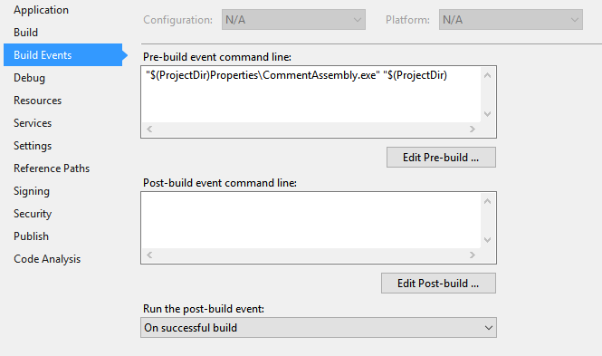
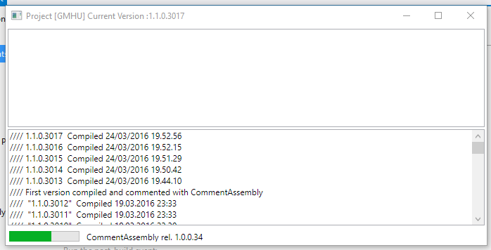
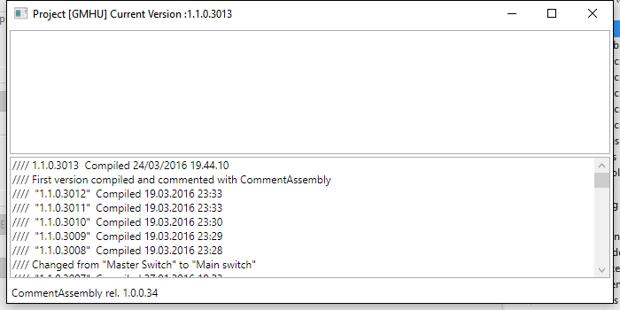
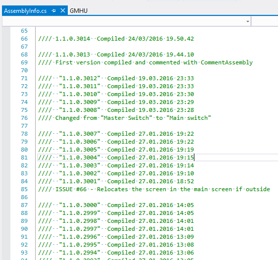

CommentAssembly
===============

The problem
-----------

If you develop software alone, keeping track of which version your customers use is extremely important. 
Specifically when your deliverables are composed by many executables and/or deployed on many cooperating computers. 

When the development is in real time and you spend your day releasing many executables to chase a bug and you need to deploy the same application on 
many computers, tracking the versions can be difficult. In fact, sometimes the problem resides in the fact that not all systems run that same last version.

For this reason, I use always to show the version number in the caption bar of the main window, but this is only half of the problem.
If you compile with a slight modification that makes the difference and you forget to update manually your version number, then two recent 
versions seem equal but they are not.

The solution
------------

This application is aimed at solving this kind of problems: every time you launch a new compilation, a dialog box will pop up where you can type notes 
about the changes implemented in this compilation cycle. The **revision** component of the Microsoft Version (rightmost, least significant number) will  
always be automatically increased so every executable will be distinguishable from any other.

All this information is stored as comments into the **AssemblyInfo.cs** that is always part of a standard Visual Studio solution and therefore it becomes a useful
documentation file.

**CommentAssembbly** is a WPF appication targeted at the .NET platform that integrates into Visual Studio.

Installation
------------

In order to install **CommentAssembly** follow these steps

1. Download the executable from here if you do not want to compile it or compile it and get the executable
2. Copy it in the **Properties** folder of your project
3. Double click on the **Properties** file in your solution by means of the Solution Viewer in the VisualStudio IDE.
4. Select the **Build events** tab. 
5. Insert in the **Pre-build event command line** the following "$(ProjectDir)Properties\CommentAssembly.exe" "$(ProjectDir)
6. Close the properties file.

Usage
-----

When you launch a new compilation, the **ContentAssembly** main window will pop up.

On the caption bar of the dialog box, you can read the name of the project you are compiling and the current version (before compilation).

The dialog has an editable top text box and a bottom read-only text box containing the list of the recent compilations and comments 

The status bar shows a progress bar and the version of CommentAssembly itself.

The dialog is closed automatically after 5 seconds of inactivity (It happens that you launch a long compilation and you forget to add comments...)
when the progress bar is finished.

If you interact with the dialog, then the countdown is interrupted.

The window will sit on top of the other windows not to loose it.

You can type your notes about the current compilation step into the top dialog box, then you close dialog and 

1. the comment is inserted into the **AssemblyInfo.cs** file
2. the version number is incremented.

How are your notest stored
---------------------------

The notes are stored as comments in the **AssemblyInfo.cs** file that normally is inside the Properties folder of your solution.

The new version number and a time stamp is written as well, storing in this file valuable information to rebuild the history of versions.
If no comment is entered, then only the timestamp is stored.

